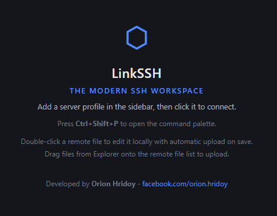
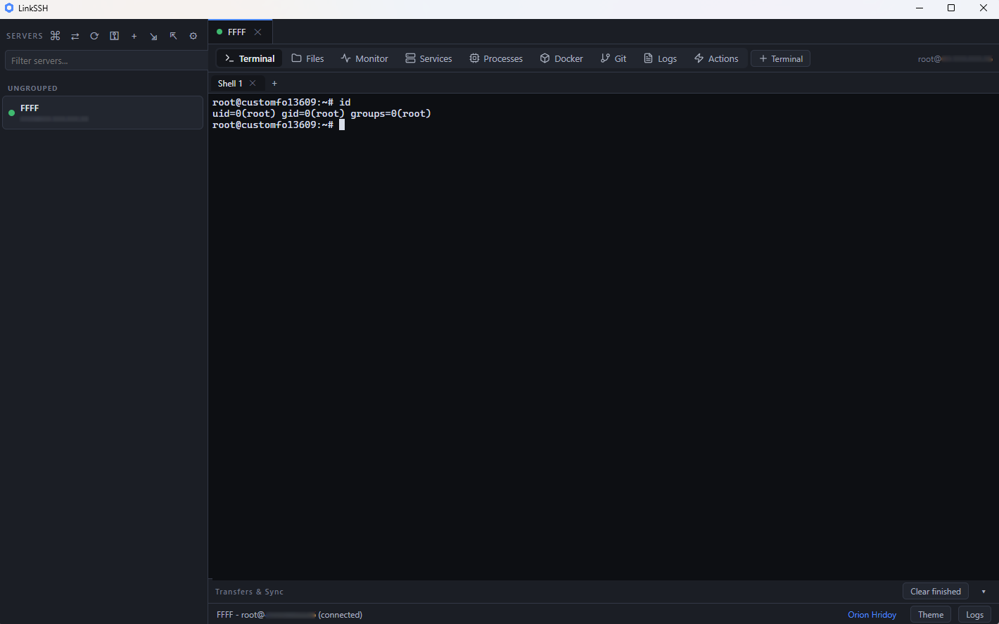
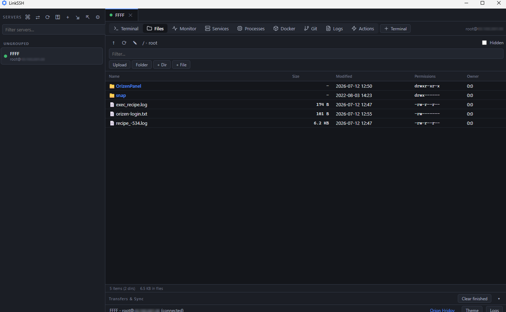
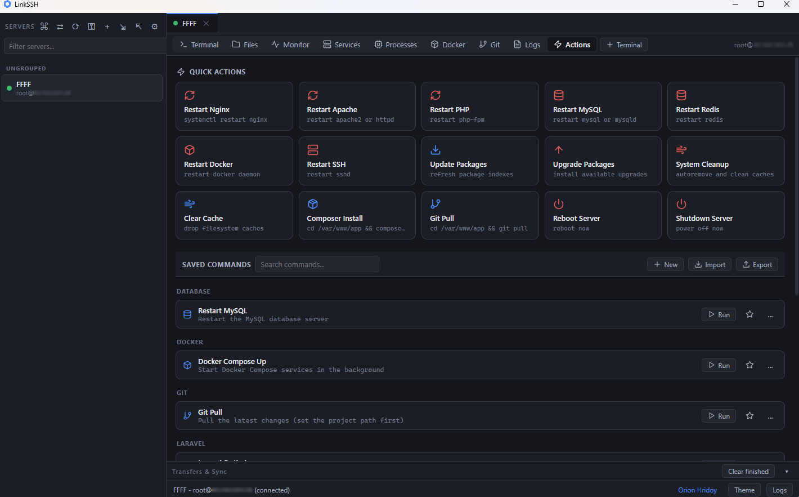
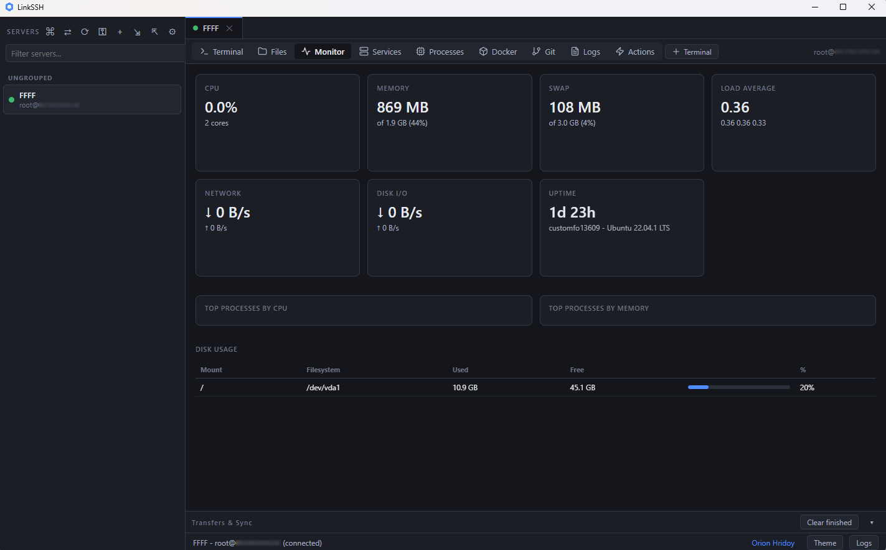

# Link SSH

**The Modern SSH Workspace**

A modern all-in-one SSH client for Windows featuring terminal, SFTP, live remote file editing, server monitoring, and advanced remote server management in a single fast desktop application.

[Download](#-download) | [Features](#-why-linkssh) | [Quick Start](#-quick-start) | [Shortcuts](#keyboard-shortcuts) | [FAQ](#-faq)

---

## 📸 Screenshots

| Dashboard | Filemanager |
|---|---|
|  |  |

| Actions | Monitor |
|---|---|
|  |  |

---

## 🚀 Why LinkSSH?

Managing a Linux server from Windows usually means three or four different tools: one for the terminal, one for file transfer, one for editing, and a browser tab for monitoring. LinkSSH replaces all of them.

| What you need | The old way | With LinkSSH |
| ------------- | ----------- | ---------- |
| Run commands over SSH | PuTTY | Built-in multi-tab terminal |
| Browse and transfer files | WinSCP / FileZilla | Built-in SFTP explorer with drag and drop |
| Edit remote config and code | Download, edit, re-upload by hand | Double-click, edit locally, auto-upload on save |
| Watch CPU, RAM, disk | htop in a second window | Live monitoring dashboard |
| Keep it all running | Four windows on your taskbar | One app, minimized to the system tray |

## ✨ Feature Highlights

### 🖥️ Full Terminal Emulator
- True xterm-256color emulation powered by xterm.js, the same engine used by VS Code
- Multiple terminal tabs per server, searchable scrollback (Ctrl+F)
- Copy and paste like PuTTY: right-click pastes, selection plus right-click copies
- Run anything your account allows: apt, docker, git, systemctl, htop, vim, tmux, mysql, and more. No artificial command restrictions

### 📁 SFTP File Explorer
- Sortable columns for name, size, modified date, permissions, and owner
- Breadcrumb navigation, editable path bar, hidden file toggle, instant filter
- Multi-select with Ctrl and Shift, recursive delete, rename, chmod dialog
- Upload by dragging files straight from Windows Explorer
- Handles symbolic links correctly, including links to directories

### ⚡ Live Remote File Editing
The killer feature. Double-click any remote file and LinkSSH will:
1. Download it to a local cache
2. Open it in your favorite editor (Notepad++, Sublime Text, VS Code, Cursor, or any exe you choose)
3. Watch for saves and upload changes back to the server automatically, with integrity verification

Your editor choice is remembered per server, so you pick it once. If someone changes the file on the server while you edit, LinkSSH detects the conflict and lets you keep local, keep remote, or keep both. Edits made while offline sync automatically on reconnect.

### 🔄 Reliable Transfer Engine
- Parallel upload and download queue with live progress
- Atomic uploads: written to a temp file, size-verified, optionally SHA-256 checked, then renamed into place. A failed transfer can never corrupt a remote file
- Automatic retry that resumes from the last completed byte
- Recursive folder upload and download

### 📊 Server Monitoring
- Live CPU usage, load average, memory, swap, and network throughput
- Disk usage per filesystem with visual warning bars
- Zero agent install: everything is read over the existing SSH connection

### 🔐 Security First
- Passwords and key passphrases encrypted with Windows DPAPI. Nothing is ever stored in plain text
- Host key pinning with trust-on-first-use and a hard warning if a server key changes (man-in-the-middle protection)
- Private key authentication, encrypted keys, and SSH agent support (Windows OpenSSH agent and Pageant)
- Sandboxed renderer, context isolation, strict Content Security Policy
- Structured logs that redact every secret

### 🧭 Command Palette
- VS Code style command palette on `Ctrl+Shift+P` with fuzzy search, keyboard navigation, and an icon for every command
- Remembers your most-used and most-recent commands and floats them to the top
- Jump to any panel, connect to any saved server, or run any saved command without touching the mouse
- Extensible command registry so new actions light up automatically

### 🛠️ Advanced Server Management
- **Services** - auto-detects Nginx, Apache, PHP-FPM, MySQL, MariaDB, Redis, Docker, SSH, Cron, and Fail2Ban with live status, colour indicators, and start / stop / restart / reload / enable / disable plus a one-click jump to that service's journal
- **Processes** - graphical process manager with search, sortable columns (CPU, memory, PID, user, time), live auto-refresh, and kill / kill-tree / force-kill with confirmation
- **Docker** - containers, images, volumes, and networks with status, ports, and live CPU / memory stats; start, stop, restart, remove, pull, open a shell, stream logs, and inspect
- **Git** - branch, upstream, ahead / behind, staged and unstaged changes, commit, stash, checkout, create branch, merge, pull / push / fetch, a colourised inline and side-by-side diff viewer, and searchable history
- **Live Logs** - stream any file with `tail -F` or a command in reusable tabs, with pause / resume, filter and highlight, line numbers, timestamps, auto-scroll, clear, download, automatic reconnect, and one-click shortcuts for the common Nginx, Apache, PHP, Laravel, syslog, auth, Docker, and PM2 logs
- **Quick Actions & Saved Commands** - one-click restarts, package updates, cleanup, and reboots, plus your own reusable commands with categories, favourites, icons, import / export, and confirmation before anything runs
- **Multi-server broadcast** - run one command across many connected servers in parallel with per-server live output, success / failure status, progress, and cancel

### 📊 Performance Dashboard
- Live, smooth charts for CPU, memory, swap, load, network, and disk I/O, with temperature when the host exposes it
- Top processes by CPU and by memory, plus per-filesystem disk usage
- High-DPI canvas rendering that stays crisp on any display

### 🔑 SSH Key Manager
- Generate Ed25519, RSA, or ECDSA key pairs (using the bundled Windows OpenSSH `ssh-keygen`)
- Import, export, rename, delete, view fingerprints, and copy the public key
- Install a public key straight into a connected server's `authorized_keys`

### 🔀 Folder Sync
- Keep a local folder and a remote folder in sync: two-way, upload-only, or download-only
- Real-time file watching (local) with periodic remote polling, plus a manual scan on start
- Delete detection, conflict detection with a keep-local / keep-remote / keep-both resolution queue
- Ignore patterns (`.git`, `node_modules`, `vendor`, and your own), progress reporting, pause / resume, per-file retry with backoff, and a persisted baseline so only real changes move

### 🔒 SSH Tunnel Manager
- Local forwards, remote forwards, and dynamic SOCKS5 proxies with a full GUI
- Create / edit / delete, start / stop, live status (active connections and bytes), and per-tunnel logs
- Port-in-use detection, automatic re-establishment of remote forwards after a reconnect, and JSON import / export

### 🔎 Diff & Merge Viewer
- Colourised inline and side-by-side diffs for Git changes and history
- Compare any remote file with a local one, then merge with Accept Left / Right / Both per change block, manual editing, and save back to the remote, the local file, or both

### 🧰 Desktop Experience Done Right
- Dark and light themes across every panel
- Command palette, context menus, skeleton loaders, toast notifications, empty states, and smooth animations throughout
- Closing the window keeps everything alive in the system tray: transfers finish, edits keep syncing, sessions stay open
- Automatic reconnect with exponential backoff. Your shells come back after a network drop
- Single instance: launching the app again just restores the window
- Server profiles with groups, favorites, per-server editor, and JSON import and export (exports never contain secrets)

## 📥 Download

Get the latest build from the [Releases](../../releases) page:

| File | Type | Best for |
| ---- | ---- | -------- |
| `LinkSSH-Setup-<version>.exe` | One-click installer | Most users. Start Menu entry, auto shortcut |
| `LinkSSH-<version>-win-x64.zip` | Portable | USB sticks, no-install environments. Unzip and run `LinkSSH.exe` |

Works on Windows 10 and Windows 11, 64-bit.

## ⚡ Quick Start

1. **Add a server.** Click the `+` button in the sidebar, enter host, username, and how you want to authenticate (password, private key, or SSH agent).
2. **Connect.** Click the profile. Verify the host key fingerprint on first connect.
3. **Work.** Use the Terminal, Files, and Monitor tabs. Double-click any file to edit it live. Drag files in to upload. Close the window and it keeps running in the tray.

## Keyboard Shortcuts

| Shortcut | Action |
| -------- | ------ |
| `Ctrl+Shift+P` | Open the command palette |
| `Ctrl+T` | New terminal tab |
| `Ctrl+Shift+W` | Close terminal tab |
| `Ctrl+Tab` | Switch between servers |
| `Ctrl+F` | Search terminal scrollback |
| `Ctrl+Shift+C` / `Ctrl+Shift+V` | Copy / paste in terminal |
| `F5` | Refresh file list, services, or processes |
| `F2` | Rename file |
| `Delete` | Delete selection |
| `Backspace` | Parent directory |
| `Ctrl+A` | Select all files |

## 🏗️ Architecture

| Layer | Technology |
| ----- | ---------- |
| Desktop shell | Electron 37 with context isolation and a sandboxed renderer |
| SSH and SFTP | ssh2 |
| Terminal | @xterm/xterm with fit, search, web links, and Unicode addons |
| File watching | chokidar 4 |
| Bundling | esbuild with strict TypeScript |
| Credential storage | Electron safeStorage backed by Windows DPAPI |

## ❓ FAQ

**Is LinkSSH free?**
Yes, the released builds are free to download and use.

**Does it work as a PuTTY or WinSCP replacement?**
Yes. It covers the everyday workflow of both: a full interactive terminal plus a complete SFTP file manager, with live editing on top.

**Which authentication methods are supported?**
Password, private key files (including encrypted keys with a passphrase prompt), keyboard-interactive, and SSH agents (Windows OpenSSH agent named pipe or Pageant).

**Where are my passwords stored?**
Encrypted with your Windows account through DPAPI, in your local user profile. They never leave your machine, and profile exports never include them.

**Can I use my own editor?**
Yes. Pick any executable in the "Open with" dialog or set it per server in the profile editor. Notepad++, Sublime Text, VS Code, and Cursor are detected automatically, even when installed in custom locations.

**What happens if my connection drops during an upload?**
The transfer engine retries automatically and resumes from the last completed byte. Uploads are atomic, so a half-finished transfer never overwrites the real file on the server.

**Does closing the window kill my session?**
No. The close button hides LinkSSH to the system tray while connections, syncing, and transfers keep running. Quit from the tray menu when you are done.

## 🗺️ Roadmap

Recently shipped: folder sync, the SSH tunnel manager, the editable merge viewer, window-state and last-directory persistence, session restore, and a resizable sidebar. Still on the list:

- Split terminal view
- Fully dockable / rearrangeable panels with multiple saved layouts
- Syntax highlighting inside the diff and merge views
- Scheduled and one-shot sync runs

## 👨‍💻 Author

Built by **Orion Hridoy**

- Facebook: [facebook.com/orion.hridoy](https://www.facebook.com/orion.hridoy)

If LinkSSH saves you time, star the repository. It helps other people find it.

## 📄 License

Proprietary. All rights reserved by Orion Hridoy.

---

**Keywords:** SSH client Windows | SFTP client | PuTTY alternative | WinSCP alternative | remote file editing | SSH terminal Windows 11 | server monitoring | SFTP file manager | secure file transfer | Linux server management from Windows

